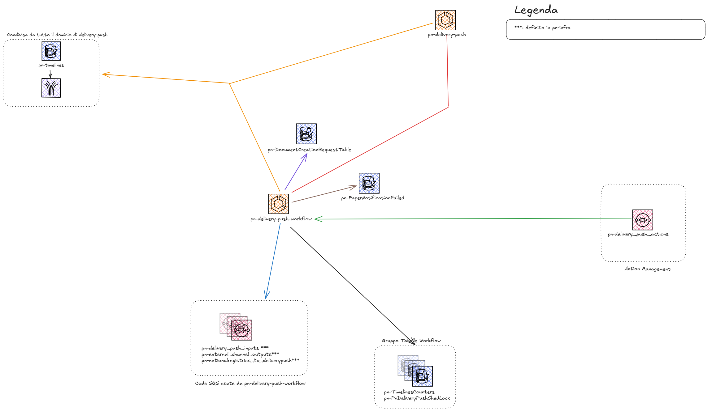

# pn-delivery-push-workflow-service

**pn-delivery-push-workflow-service** è un microservizio che gestisce l’intero workflow della notifica successivo alla fase di validazione nell’ecosistema `SEND`. Il servizio si occupa di orchestrare le diverse fasi del processo notificativo, integrando componenti sia digitali che analogici.
Riceve notifiche già validate e coordina le seguenti attività:
- **Invio di messaggi di cortesia ai destinatari**
- **Scelta del canale di notificazione (digitale o analogico)**
- **Gestione della logica di business per il workflow digitale**
- **Gestione parziale del workflow analogico (con delega delle logiche principali al microservizio `pn-paper-channel`)**
- **Perfezionamento della notifica**
- **Visualizzazione delle notifiche**
- **Gestione della notificazione di pagamento (inserimento informativa in timeline)**
- **Gestione asincrona dell’annullamento della notifica (la parte sincrona è gestita da un altro microservizio)**

Il workflow viene avviato tramite un unico punto di ingresso: al termine della validazione, un messaggio di tipo `POST_ACCEPTED_PROCESSING_COMPLETED` viene inviato sulla coda SQS pn-delivery-push-action. 
Il completamento del processo varia in base al percorso notificativo specifico di ciascuna notifica.

## Panoramica
Si compone di:
- **Microservizio pn-delivery-push-workflow-service**: gestisce l’orchestrazione del workflow notificativo successivo alla validazione, coordinando le interazioni tra i diversi canali (digitali e analogici) e i servizi esterni.
- **Lambda pn-notificationCancellationActionInsert-workflow**: si occupa della gestione asincrona delle richieste di annullamento notifica, inserendo le relative azioni nel workflow tramite eventi su stream Kinesis.
- **Lambda pn-paperEventsCostUpdate-workflow**: aggiorna i costi degli eventi relativi alle notifiche cartacee, leggendo gli eventi da uno stream Kinesis e propagando le informazioni verso i registri esterni tramite coda SQS.

### Architettura

https://excalidraw.com/#json=Hk7Qa4AjNhfcMAS_fbEjZ,7_8WMPSLNGf3nP-s7MzuWQ
## Componenti

### pn-delivery-push-workflow-service

#### Responsabilità
- Legge sulle code SQS: DeliveryPushInputsQueue, ExternalChannelsOutputsQueue, ScheduledActionsQueue, NationalRegistries2DeliveryPushQueue
- Legge e scrive sulle tabelle DynamoDB: PaperNotificationFailedDynamoTable, DocumentCreationRequestTable

#### Configurazione
| Variabile Ambiente                                                       | Descrizione                                      | Default | Obbligatorio |
|--------------------------------------------------------------------------|--------------------------------------------------|---------|--------------|
| AWS_REGIONCODE                                                           | aws region                                       | -       | Si           |
| PN_DELIVERYPUSHWORKFLOW_TOPICS_NEWNOTIFICATIONS                          | Queue to pull for inputs event                   | -       | Si           |
| PN_DELIVERYPUSHWORKFLOW_TOPICS_NATIONALREGISTRIESEVENTS                  | National Registries to delivery-push queue name  | -       | Si           |
| PN_DELIVERYPUSHWORKFLOW_TOPICS_FROMEXTERNALCHANNEL                       | Pull external-channel messages from this Queue   | -       | Si           |
| PN_DELIVERYPUSHWORKFLOW_TOPICS_SCHEDULEDACTIONS                          | Send and pull ready-to-do actions th this queue  | -       | Si           |
| PN_DELIVERYPUSHWORKFLOW_EXTERNALCHANNELBASEURL=${ExternalChannelBaseUrl} | external channel base url                        | -       | Si           |
| PN_DELIVERYPUSHWORKFLOW_PAPERCHANNELBASEURL                              | paper channel base url                           | -       | Si           |
| PN_DELIVERYPUSHWORKFLOW_USERATTRIBUTESBASEURL                            | user attributes base url                         | -       | Si           |
| PN_DELIVERYPUSHWORKFLOW_SAFESTORAGEBASEURL                               | Safe storage base url                            | -       | Si           |
| PN_DELIVERYPUSHWORKFLOW_DELIVERYBASEURL                                  | delivery base url                                | -       | Si           |
| PN_DELIVERYPUSHWORKFLOW_MANDATEBASEURL                                   | mandate base url                                 | -       | Si           |
| PN_DELIVERYPUSHWORKFLOW_EXTERNALREGISTRYBASEURL                          | external registry base url                       | -       | Si           |
| PN_DELIVERYPUSHWORKFLOW_TEMPLATESENGINEBASEURL                           | templates engine base url                        | -       | Si           |
| PN_DELIVERYPUSHWORKFLOW_TIMELINECLIENTBASEURL                            | timeline client base url                         | -       | Si           |
| PN_DELIVERYPUSHWORKFLOW_EMDINTEGRATIONBASEURL                            | emd integration base url                         | -       | Si           |
| PN_DELIVERYPUSHWORKFLOW_ACTIONMANAGERBASEURL                             | action manager base url                          | -       | Si           |
| PN_DELIVERYPUSHWORKFLOW_NATIONALREGISTRIESBASEURL                        | national registries base url                     | -       | Si           |
| PN_DELIVERYPUSHWORKFLOW_DATAVAULTBASEURL                                 | data vault base url                              | -       | Si           |
| PN_DELIVERYPUSHWORKFLOW_DELIVERYPUSHBASEURL                              | delivery push base url                           | -       | Si           |
| PN_DELIVERYPUSHWORKFLOW_DOCUMENTCREATIONREQUESTDAO_TABLENAME             | DynamoDb Table name                              | -       | Si           |
| PN_DELIVERYPUSHWORKFLOW_FAILEDNOTIFICATIONDAO_TABLENAME                  | DynamoDb Table name                              | -       | Si           |
| PN_CRON_ANALYZER                                                         | Cron for which you send the metric to CloudWatch | -       | No           |
| WIRE_TAP_LOG                                                             | Activation of wire logs                          | -       | No           |
| PN_DELIVERYPUSHWORKFLOW_PAPERTRACKERBASEURL                              | paper tracker base url                           | -       | Si           |

### DeliveryPushInputsQueue

### Configurazione
- **Variabile d'ambiente**: `PN_DELIVERYPUSHWORKFLOW_TOPICS_NEWNOTIFICATIONS`
- **Tipo**: Input

### Funzionamento
- **Scopo**: Gestisce eventi relativi al processo di visualizzazione o pagamento di una notifica.
- **Trigger**: Visualizzazione della notifica o pagamento.
---

### NationalRegistries2DeliveryPushQueue

### Configurazione
- **Variabile d'ambiente**: `PN_DELIVERYPUSHWORKFLOW_TOPICS_NATIONALREGISTRIESEVENTS`
- **Tipo**: Input

### Funzionamento
- **Scopo**:Gestisce le risposte le risposte api asincrone di pn-national-registries per il recupero degli indirizzi digitali o cartacei.
- **Trigger**: Termine del processo di recupero indirizzo lato pn-national-registries.
---

### ScheduledActionsQueue

### Configurazione
- **Variabile d'ambiente**: `PN_DELIVERYPUSHWORKFLOW_TOPICS_SCHEDULEDACTIONS`
- **Tipo**: Input

### Funzionamento
- **Scopo**: Gestisce le action legate ai flussi del dominio di workflow.
- **Trigger**: Scheduling automatico o eventi di errore.
---

### ExternalChannelsOutputsQueue
### Configurazione
- **Variabile d'ambiente**: `PN_DELIVERYPUSHWORKFLOW_TOPICS_FROMEXTERNALCHANNEL`
- **Tipo**: Input

### Funzionamento
- **Scopo**: Gestisce tutti gli eventi relativi ai processi di invio notifiche su canali digitali o analogici.
- **Trigger**: Avanzamento del processo di invio
---

### PaperNotificationFailedDynamoTable

### Configurazione
- **Variabile d'ambiente**: `PN_DELIVERYPUSHWORKFLOW_FAILEDNOTIFICATIONDAO_TABLENAME`
- **Nome risorsa CloudFormation**: `PaperNotificationFailedDynamoTableName`
- **Tipo**: Tabella DynamoDB
- **Funzionalità**: La tabella PaperNotificationFailedDynamoTable viene utilizzata per persistere tutte le notifiche cartacee che non sono state consegnate.
---
### DocumentCreationRequestTable

### Configurazione
- **Variabile d'ambiente**: `PN_DELIVERYPUSHVALIDATOR_DOCUMENTCREATIONREQUESTDAO_TABLENAME`
- **Nome risorsa CloudFormation**: `DocumentCreationRequestTableName`
- **Tipo**: Tabella DynamoDB
- **Funzionalità**: La tabella DocumentCreationRequestTable viene utilizzata per persistere le informazioni della richiesta di creazione del legalFacts per poter effettuare successivamente una lookup dal responseHandler di SafeStorage
---
### pn-notificationCancellationActionInsert-workflow

#### Responsabilità
- **Gestisce un messaggio stream Kinesis `CdcKinesisSourceStream` e il fine è inserire un action richiamando `pn-action-manager`.**
- **Elabora messaggi dallo stream Kinesis effettuando un filtro per recuperare eventi relativi a elementi di timeline relativi a una richiesta di annullamento notifica(`NOTIFICATION_CANCELLATION`).**
- **Inserisce le action di annullamento notifica (`NOTIFICATION_CANCELLATION`), interagendo con `pn-action-manager` che le smisterà in modo asincrono sul ms di `pn-delivery-push-workflow` per portare avanti il processo di annullamento della notifica.**

#### Funzionalità
Questa Lambda gestisce l’inserimento asincrono delle azioni di annullamento notifica all’interno del workflow. 
Riceve eventi da uno stream Kinesis, elabora le richieste di annullamento e interagisce con `pn-action-manager` per aggiornare lo stato della notifica.

#### Configurazione
| Variabile Ambiente      | Descrizione             | Default | Obbligatorio |
|-------------------------|-------------------------|---------|--------------|
| REGION                  | aws region              | -       | Si           |
| ACTION_MANAGER_BASE_URL | Action Manager base url | -       | Si           |

N.B. La lambda utilizzerà un meccanismo di feature flag temporizzato, basato sull’`eventTimestamp` di kinesis 
che permetterà di attivare o disattivare le nuove in maniera programmatica.
I parametri utilizzati saranno i seguenti: `NewWorkflowLambdasEnabledStart` e `NewWorkflowLambdasEnabledEnd`

### pn-paperEventsCostUpdate-workflow

#### Responsabilità
- **gestisce un messaggio Kinesis `CdcKinesisSourceStream` e il fine e inserire un messaggio su una coda letta da `pn-external-registries`.**
- **Per ogni evento, estrae le informazioni necessarie per il calcolo o aggiornamento dei costi associati all’evento.**
- **Esegue la logica di calcolo/aggiornamento dei costi.**
- **Invia le informazioni aggiornate verso la coda SQS `DeliveryPushToExternalRegistriesQueue` verrà letta sul ms `pn-external-registries`.**

#### Funzionalità
Questa Lambda aggiorna i costi associati agli eventi delle notifiche cartacee. Processa gli eventi provenienti dallo stream Kinesis, 
calcola o aggiorna i costi e invia le informazioni aggiornate verso `pn-external-registries` sulla sua coda SQS.

#### Configurazione
| Variabile Ambiente | Descrizione                                    | Default | Obbligatorio |
|--------------------|------------------------------------------------|---------|--------------|
| REGION             | aws region                                     | -       | Si           |
| QUEUE_URL          | delivery-push to external-registries queue URL | -       | Si           |

N.B. La lambda utilizzerà un meccanismo di feature flag temporizzato, basato sull’`eventTimestamp` di kinesis
che permetterà di attivare o disattivare le nuove in maniera programmatica.
I parametri utilizzati saranno i seguenti: `NewWorkflowLambdasEnabledStart` e `NewWorkflowLambdasEnabledEnd`
