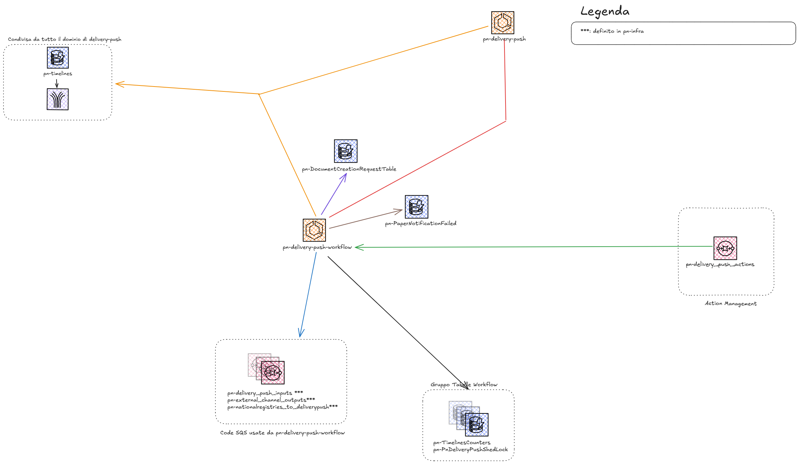

# pn-delivery-push-workflow-service

## Indice
- [Descrizione](#descrizione)
- [Tecnologie Utilizzate](#tecnologie-utilizzate)
- [Architettura](#architettura)
- [Interfacce del Servizio](#interfacce-del-servizio)
- [Configurazioni](#configurazioni)
- [Allarmi e Monitoraggio](#allarmi-e-monitoraggio)
- [Esecuzione](#esecuzione)

## Descrizione

**pn-delivery-push-workflow-service** è un microservizio che gestisce l’intero workflow della notifica successivo alla fase di validazione nell’ecosistema `SEND`. Il servizio si occupa di orchestrare le diverse fasi del processo notificativo, integrando componenti sia digitali che analogici.
Riceve notifiche già validate e coordina le seguenti attività:
- **Invio di messaggi di cortesia ai destinatari**
- **Scelta del canale di notificazione (digitale o analogico)**
- **Gestione della logica di business per il workflow digitale**
- **Gestione parziale del workflow analogico (con delega delle logiche principali al microservizio `pn-paper-channel`)**
- **Perfezionamento della notifica**
- **Visualizzazione delle notifiche**
- **Gestione della notificazione di pagamento (inserimento informativa in timeline)**
- **Gestione asincrona dell’annullamento della notifica (la parte sincrona è gestita da un altro microservizio)**

Il workflow viene avviato tramite un unico punto di ingresso: al termine della validazione, un messaggio di tipo `POST_ACCEPTED_PROCESSING_COMPLETED` viene inviato sulla coda SQS pn-delivery-push-action. 
Il completamento del processo varia in base al percorso notificativo specifico di ciascuna notifica.

## Tecnologie Utilizzate

### Stack Tecnologico
- Java, Spring Boot 3 (parent `pn-parent` versione `2.1.3-SPRINGBOOT3`)
- Spring Cloud AWS (integrazione SQS)
- Spring Cloud Stream
- AWS SDK v2 - DynamoDB Enhanced Client
- Node.js 22.x (funzioni Lambda `pn-notificationCancellationActionInsert-workflow` e `pn-paperEventsCostUpdate-workflow`)

### Infrastruttura
- Amazon ECS Fargate (esecuzione del microservizio principale)
- AWS Lambda (funzioni Node.js)
- Amazon SQS (code di input/output)
- Amazon DynamoDB (`PaperNotificationFailedDynamoTable`, `DocumentCreationRequestTable`)
- Amazon Kinesis Data Streams (`CdcKinesisSourceStream`, sorgente degli event source mapping delle Lambda)
- Amazon EventBridge (regole di routing verso le code SQS)
- Amazon CloudWatch (alarm e dashboard)

## Architettura
Si compone di:
- **Microservizio pn-delivery-push-workflow-service**: gestisce l’orchestrazione del workflow notificativo successivo alla validazione, coordinando le interazioni tra i diversi canali (digitali e analogici) e i servizi esterni.
- **Lambda pn-notificationCancellationActionInsert-workflow**: si occupa della gestione asincrona delle richieste di annullamento notifica, inserendo le relative azioni nel workflow tramite eventi su stream Kinesis.
- **Lambda pn-paperEventsCostUpdate-workflow**: aggiorna i costi degli eventi relativi alle notifiche cartacee, leggendo gli eventi da uno stream Kinesis e propagando le informazioni verso i registri esterni tramite coda SQS.


https://excalidraw.com/#json=Hk7Qa4AjNhfcMAS_fbEjZ,7_8WMPSLNGf3nP-s7MzuWQ

Questa Lambda gestisce l’inserimento asincrono delle azioni di annullamento notifica all’interno del workflow.
Riceve eventi da uno stream Kinesis, elabora le richieste di annullamento e interagisce con `pn-action-manager` per aggiornare lo stato della notifica.

N.B. La lambda utilizzerà un meccanismo di feature flag temporizzato, basato sull’`eventTimestamp` di kinesis
che permetterà di attivare o disattivare le nuove in maniera programmatica.
I parametri utilizzati saranno i seguenti: `NewWorkflowLambdasEnabledStart` e `NewWorkflowLambdasEnabledEnd`

Questa Lambda aggiorna i costi associati agli eventi delle notifiche cartacee. Processa gli eventi provenienti dallo stream Kinesis,
calcola o aggiorna i costi e invia le informazioni aggiornate verso `pn-external-registries` sulla sua coda SQS.

N.B. La lambda utilizzerà un meccanismo di feature flag temporizzato, basato sull’`eventTimestamp` di kinesis
che permetterà di attivare o disattivare le nuove in maniera programmatica.
I parametri utilizzati saranno i seguenti: `NewWorkflowLambdasEnabledStart` e `NewWorkflowLambdasEnabledEnd`

## Interfacce del Servizio

| Tipo  | Dir | Risorsa                              | Protocollo | Metodo  | Route | Descrizione                                                                                     |
|-------|-----|---------------------------------------|------------|---------|-------|---------------------------------------------------------------------------------------------------|
| EVENT | IN  | DeliveryPushInputsQueue               | SQS        | CONSUME | -     | Gestisce eventi relativi al processo di visualizzazione o pagamento di una notifica.               |
| EVENT | IN  | NationalRegistries2DeliveryPushQueue  | SQS        | CONSUME | -     | Gestisce le risposte api asincrone di pn-national-registries per il recupero degli indirizzi.      |
| EVENT | IN  | ScheduledActionsQueue                 | SQS        | CONSUME | -     | Gestisce le action legate ai flussi del dominio di workflow.                                       |
| EVENT | IN  | ExternalChannelsOutputsQueue          | SQS        | CONSUME | -     | Gestisce tutti gli eventi relativi ai processi di invio notifiche su canali digitali o analogici.  |
| EVENT | OUT | DeliveryPushToExternalRegistriesQueue | SQS        | PRODUCE | -     | Invia verso `pn-external-registries` le informazioni aggiornate sui costi degli eventi cartacei.   |

## Configurazioni

| Nome                                                          | Sorgente | Valori | Descrizione                                       |
|-----------------------------------------------------------------|----------|--------|----------------------------------------------------|
| PN_DELIVERYPUSHWORKFLOW_TOPICS_NEWNOTIFICATIONS                  | ENV      | -      | Queue to pull for inputs event                     |
| PN_DELIVERYPUSHWORKFLOW_TOPICS_NATIONALREGISTRIESEVENTS          | ENV      | -      | National Registries to delivery-push queue name    |
| PN_DELIVERYPUSHWORKFLOW_TOPICS_FROMEXTERNALCHANNEL               | ENV      | -      | Pull external-channel messages from this Queue     |
| PN_DELIVERYPUSHWORKFLOW_TOPICS_SCHEDULEDACTIONS                  | ENV      | -      | Send and pull ready-to-do actions th this queue     |
| PN_DELIVERYPUSHWORKFLOW_EXTERNALCHANNELBASEURL                   | ENV      | -      | external channel base url                          |
| PN_DELIVERYPUSHWORKFLOW_PAPERCHANNELBASEURL                       | ENV      | -      | paper channel base url                             |
| PN_DELIVERYPUSHWORKFLOW_USERATTRIBUTESBASEURL                     | ENV      | -      | user attributes base url                           |
| PN_DELIVERYPUSHWORKFLOW_SAFESTORAGEBASEURL                        | ENV      | -      | Safe storage base url                              |
| PN_DELIVERYPUSHWORKFLOW_DELIVERYBASEURL                           | ENV      | -      | delivery base url                                  |
| PN_DELIVERYPUSHWORKFLOW_MANDATEBASEURL                            | ENV      | -      | mandate base url                                   |
| PN_DELIVERYPUSHWORKFLOW_EXTERNALREGISTRYBASEURL                   | ENV      | -      | external registry base url                         |
| PN_DELIVERYPUSHWORKFLOW_TEMPLATESENGINEBASEURL                    | ENV      | -      | templates engine base url                          |
| PN_DELIVERYPUSHWORKFLOW_TIMELINECLIENTBASEURL                     | ENV      | -      | timeline client base url                           |
| PN_DELIVERYPUSHWORKFLOW_EMDINTEGRATIONBASEURL                     | ENV      | -      | emd integration base url                           |
| PN_DELIVERYPUSHWORKFLOW_ACTIONMANAGERBASEURL                      | ENV      | -      | action manager base url                            |
| PN_DELIVERYPUSHWORKFLOW_NATIONALREGISTRIESBASEURL                 | ENV      | -      | national registries base url                       |
| PN_DELIVERYPUSHWORKFLOW_DATAVAULTBASEURL                          | ENV      | -      | data vault base url                                |
| PN_DELIVERYPUSHWORKFLOW_DELIVERYPUSHBASEURL                       | ENV      | -      | delivery push base url                             |
| PN_DELIVERYPUSHWORKFLOW_DOCUMENTCREATIONREQUESTDAO_TABLENAME      | ENV      | -      | DynamoDb Table name (`DocumentCreationRequestTable`) |
| PN_DELIVERYPUSHWORKFLOW_FAILEDNOTIFICATIONDAO_TABLENAME           | ENV      | -      | DynamoDb Table name (`PaperNotificationFailedDynamoTable`) |
| PN_DELIVERYPUSHWORKFLOW_PAPERTRACKERBASEURL                       | ENV      | -      | paper tracker base url                             |
| ACTION_MANAGER_BASE_URL                                           | ENV      | -      | Action Manager base url (lambda `pn-notificationCancellationActionInsert-workflow`) |
| QUEUE_URL                                                         | ENV      | -      | delivery-push to external-registries queue URL (lambda `pn-paperEventsCostUpdate-workflow`) |

## Allarmi e Monitoraggio

| Tipo      | Nome                                                     | Descrizione                                                                                                                    |
|-----------|-----------------------------------------------------------|----------------------------------------------------------------------------------------------------------------------------------|
| ALARM     | `${ProjectName}-delivery-push-workflow-service-autoscaling-custom` | Alarm basato sul numero di messaggi visibili sulle code `DeliveryPushInputsQueue` ed `ExternalChannelsOutputsQueue`, utilizzato per l'autoscaling custom del servizio. |
| ALARM     | `${ProjectName}-NotificationCancellationActionInsert-ESM-Alarm`    | Segnala fallimenti di lettura dallo stream Kinesis da parte della Lambda `pn-notificationCancellationActionInsert-workflow`.     |
| ALARM     | `${ProjectName}-PaperEventsCostUpdate-ESM-Alarm`                   | Segnala fallimenti di lettura dallo stream Kinesis da parte della Lambda `pn-paperEventsCostUpdate-workflow`.                    |
| DASHBOARD | `${ProjectName}-delivery-push-workflow-service`                    | Dashboard CloudWatch del microservizio.                                                                                          |

## Esecuzione

```bash
# Prerequisiti: JDK compatibile con Spring Boot 3 (versione ereditata dal parent pn-parent)
# Maven wrapper incluso nel repository (mvnw)

# Build
./mvnw clean install

# Test
./mvnw test

# Avvio locale
./mvnw spring-boot:run
```
